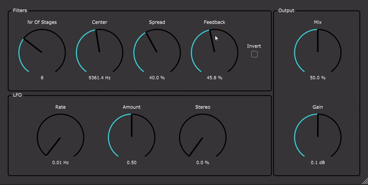

# Phaser
A Phaser effect plugin built using JUCE.

## Overview
The Phaser splits the incoming audio signal into two paths: a dry signal and a wet signal. The wet signal is processed through a series of all-pass filters, 
which alter the phase of the signal. When the dry and wet signals are combined, the phase differences create characteristic notches in the frequency spectrum, producing the classic phaser sound.

## Parameters
The phaser contains parameters for:

* Nr Of Stages: the amount of allpass filters the wet signal gets passed through. It creates the notches.
* Center: Sets the centre frequency (in Hz) of the phaser all-pass filters modulation.
* Spread: Set the spread of these stages.
* Feedback: Sets the feedback volume (between -1 and 1) of the phaser.
* Invert: Inverts the feedback signal
* Rate: Sets the rate (in Hz) of the LFO modulating the phasers all-pass filters
* Amount: Sets the volume (between 0 and 1) of the LFO modulating the phaser all-pass filters.
* Stereo: Sets offset to one of the channels in the lfo to create a stereo effect.
* Mix: Sets the amount of dry and wet signal in the output of the phaser (between 0 for full dry and 1 for full wet).
* Gain: Sets the amount of output volume

## How It Works

### All-Pass Filters
An all-pass filter alters the phase of certain frequencies without changing their gain. The filter used in this plugin is an IIR (Infinite Impulse Response) first-order all-pass filter. 
This type of filter introduces a phase shift at specific frequencies, contributing to the phaser effect when mixed with the dry signal.

IIR formula: 
$y[n] = c \cdot x[n] + x[n-1] - c \cdot y[n-1]$

* $x[n]$ is the input signal at time $n$.
* $y[n]$ is the output signal at time $n$.
* $c$ is the filter coefficient.
* $x[n-1]$ is the input signal at the previous time step.
* $y[n-1]$ is the output signal at the previous time step.

Filter coefficient formula:
$c = \frac{\tan\left(\frac{\pi \cdot f_c}{f_s}\right) - 1}{\tan\left(\frac{\pi \cdot f_c}{f_s}\right) + 1}$

* $f_c$ is the cutoff frequency.
* $f_s$ is the sample rate.

### Feedback
The feedback parameter controls the amount of the wet signal that is fed back into itself, creating deeper and more pronounced phasing effects. There is also an option to invert the feedback signal, further altering the character of the effect.

### LFO (Low-Frequency Oscillator)
The LFO modulates the frequencies at which the all-pass filters introduce phase shifts, sweeping these notches across the frequency spectrum. This modulation is implemented using JUCE's built-in Oscillator class, creating a low-frequency oscillator that drives the phaser effect.
